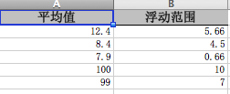
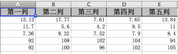

# LinkTools

## functions
- check dead links quickly by multi threads and httpClient4 

## DONE
- extract url from html
- extract url from json

#number-generator
> 指定范围的随机数生成器
# 功能简介
指定平均值和浮动范围生成5个随机数。
采用excel导入，批量生成，最后将结果输出到结果excel。
示例
- 输入

- 输出


# 核心算法
输入参数 平均值=12.4 浮动范围=5，也就是说随机数的范围是[12.4-5, 12.4+5]
1.生成两个小于平均值的随机数
```
n1=rand(7.4,12.4)
n2=rand(7.4,12.4)
```
2.生成两个大于平均值的随机数
```
n3=rand(12.4,17.4)
n4=rand(12.4,17.4)
n5=12.4*5 - SUM(n1,n2,n3,n4)
```
3.判断n5是否满足条件
```
IF(7.4 <= n5 <= 17.4)
    return;
else
    again;
end
```

# excel工具
采用alibaba easyexcel工具，简化了对poi的操作。


